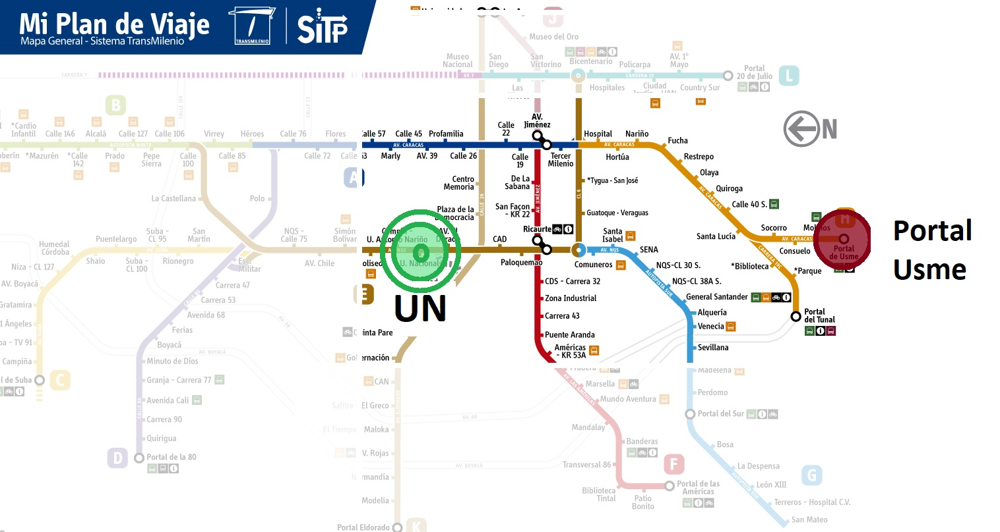
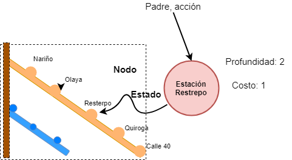
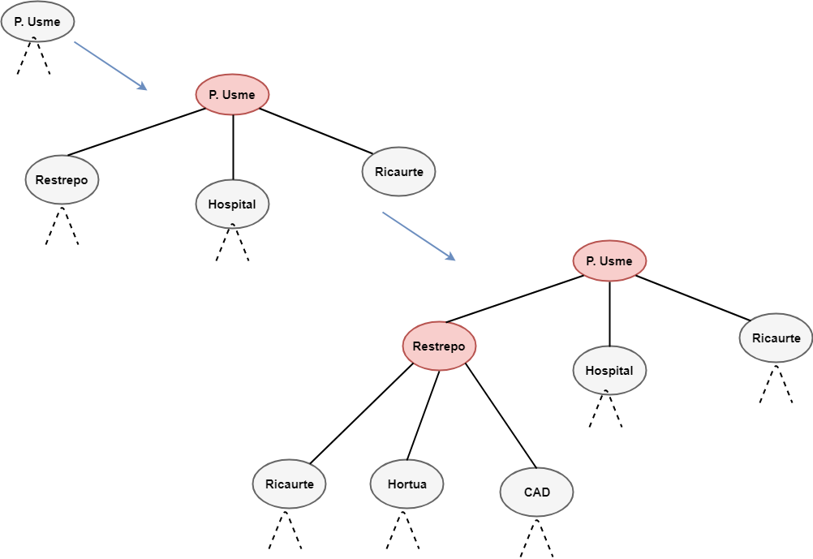

<section id="themes">
	<h2>Themes</h2>
		

			Set your presentation theme:  
			<!-- Hacks to swap themes after the page has loaded. Not flexible and only intended for the reveal.js demo deck. -->
			<a href="#" onclick="document.getElementById('theme').setAttribute('href','css/theme/black.css'); return false;">Black (default)</a> -
			<a href="#" onclick="document.getElementById('theme').setAttribute('href','css/theme/white.css'); return false;">White</a> -
			<a href="#" onclick="document.getElementById('theme').setAttribute('href','css/theme/league.css'); return false;">League</a> -
			<a href="#" onclick="document.getElementById('theme').setAttribute('href','css/theme/sky.css'); return false;">Sky</a> -
			<a href="#" onclick="document.getElementById('theme').setAttribute('href','css/theme/beige.css'); return false;">Beige</a> -
			<a href="#" onclick="document.getElementById('theme').setAttribute('href','css/theme/simple.css'); return false;">Simple</a>  
			<a href="#" onclick="document.getElementById('theme').setAttribute('href','css/theme/serif.css'); return false;">Serif</a> -
			<a href="#" onclick="document.getElementById('theme').setAttribute('href','css/theme/night.css'); return false;">Night</a> -
			<a href="#" onclick="document.getElementById('theme').setAttribute('href','css/theme/moon.css'); return false;">Moon</a> -
			<a href="#" onclick="document.getElementById('theme').setAttribute('href','css/theme/solarized.css'); return false;">Solarized</a>
		

</section>

H:

# ** Problem Solving by Searching **
### FutureUN - Sistemas Inteligentes 2018 - 1
by  [Sebastian Chaves](https://github.com/adamantwharf) - [Laura Santos](https://github.com/lsfinite) - [Jimmy Pulido](https://github.com/jiapulidoar)

H:

# Index

<!-- .slide: data-background="#7E2121" -->
 1.  <!-- .element: class="fragment" data-fragment-index="1"-->
 1. El 16-Puzzle  <!-- .element: class="fragment" data-fragment-index="2"-->
 1. Estrategias de Búsqueda <!-- .element: class="fragment" data-fragment-index="3"-->
	* Breadth-first Search <!-- .element: class="fragment" data-fragment-index="3"-->
	* Uniform-cost Search <!-- .element: class="fragment" data-fragment-index="3"-->
	* Depth-first Search <!-- .element: class="fragment" data-fragment-index="3"-->
	* Iterative Deepening Search <!-- .element: class="fragment" data-fragment-index="3"-->
	* A* Search <!-- .element: class="fragment" data-fragment-index="3"-->
 1. Our implementation <!-- .element: class="fragment" data-fragment-index="4"-->

H:

## Agentes Solucionadores de Problemas
<!-- .slide: data-background="#005050" -->
* Agentes basados en objetivos que deciden qué hacer para encontrar secuencias de acciones que conduzcan a estados deseables.
* Usan la representación atómica: Estados del mundo son considerados como un todo.

V:
### Formulación de objetivo:
Agente se le atribuye un **objetivo** (conjunto de estados del mundo) 하는 목적  y trata de satisfacerlo.

*Situación actual y Medida de Rendimieto*
>Medida de rendimiento: Criterio de la conducta del agente para lograr éxito.

¿Cómo debo actuar en el futuro?  <!-- .element: class="fragment" data-fragment-index="1"-->

V:

 ### Formulación del Problema

Dado un objetivo:
> es el proceso de decidir qué acciones y estados deben se considerados en la *búsqueda* de los estados deseables.

H:
### Ejemplo: Viaje en transmilenio:

<!-- .slide: data-background="#FFFFFF" -->
* En hora pico; actualmente en el Portal Sur. Clase de 7.
* Objetivo: Llegar al campus de la UN a tiempo.

 </img>

V:
##### Ejemplo: Viaje en transmilenio:
* **Medida de rendimiento:** Menor cantidad de transbordos, llegar en el menor tiempo posible, ruta más vacia, etc.
* Formulación de problema:
	* Estados: Estaciones.
	* Acciones: Tomar un bus de una estación a otra.

> Suponer que el agente tiene un mapa de transmilenio y no existe una ruta directa. Ambiente es observable, discreto (finitas opciones), y determinístico (1 acción, 1 salida).

V:
### Un problema tiene:

Estados, Estado inicial, función sucesor, Test objetivo, costo del camnino.

**¿Cómo hacer?**
> Sabemos que: El agente está en un estado inicial y sabemos donde va a ir tomada una acción.

Búsqueda: Proceso de entonctrar uns secuencia de acciones que cumpla con el objetivo.

V:
<!-- .slide: data-background="#FFFFFF" -->

### Busquedas de Soluciones:

<!-- .slide: data-background="#7E2121" -->

* Resolución de problemas se hace mediante búsqueda a través del espacio de estados.
* Técnica básica: Árbol de búsqueda.  generado a partir del estado inicial y la función de transición. Nuevos Nodos.

*Nodo:* Estado, Nodo Padre, Acción, Costo, Profundidad.

 </img>

H:
<!-- .slide: data-background="#FFFFFF" -->

 </img>

V:
### Galaga
<!-- .slide: data-background="#7E2121"  -->
  >A version of the clasic game. Is an arcade video game developed by Tomohiro Nishikado and released in 1978 <!-- .element: class="fragment" data-fragment-index="1"-->

More information on [Wikipedia](https://en.wikipedia.org/wiki/Space_Invaders) <!-- .element: class="fragment" data-fragment-index="1"-->

V:
#### Galaga Running! 
<!-- .slide: data-background="#000000"  -->
<iframe src="sketches/Galaga.html" width="700" height="700" align="center">

V:
### Clouds
  > How far can you go?? The sky is the limit. With this game you will jump the higher you can. Just move te bus with the mouse to go up.

The inspiration for this game was the experience as a gamer. <!-- .element: class="fragment" data-fragment-index="1"-->

V:
#### Transmi-Cloud Running...
<iframe src="sketches/Clouds.html" width="700" height="700" align="center">

V:
## Sticks
> This game was based on the Towers of Hanoi. This Puzzle is a mathematical game invented in 1883 by the French mathematician Edouard Lucas.

The more you play, the more difficult it will become.

For more information, on [Wikipedia]( https://es.wikipedia.org/wiki/Torres_de_Hanói)

V:
#### Sticks Running...
<iframe src="sketches/Stick.html" width="700" height="700" align="center">

V:
## Colors
<!-- .slide: data-background="#7E2121"  -->
> This game consist of let the drop fall in the correct color cube. The drop will follow the mouse position.If you lose, just ckick any part of the canvas, a the game will start again.  
V:
#### Colors Running...
<iframe src="sketches/Colors.html" width="700" height="700" align="center">

V:

## Bounce
 >Version of the classic game of the red ball that have to pass thought different mazes to achive their goal. The ball obeys the up/down, right/left arrows of the keyboard.

V:
#### Bounce Running...
<iframe src="sketches/Bounce.html" width="700" height="700" align="center">

V:
## Resume
| The games   | How to play them                 |
| ------------|:--------------------------------:|
| Galaga      | Up/down arrows and mouse press   |
| Clouds      | With the position of the mouse   |  
| Sticks      | Ckick the towers with the mouse  |
| Colors      | Follow the mouse position        |
|Bounce       | Use your keyboard arrows to play |

H:

## Now Available for web:  

 http:// futureun.github.io/FutureGame 
<!-- .slide: data-background="#2E9AFE"  -->

V:
## References

* [P5*JS](http://p5js.org/)
* [P5.PLay](http://p5play.molleindustria.org/)
* [Sounds Resources](http://www.sounds-resource.com/)
